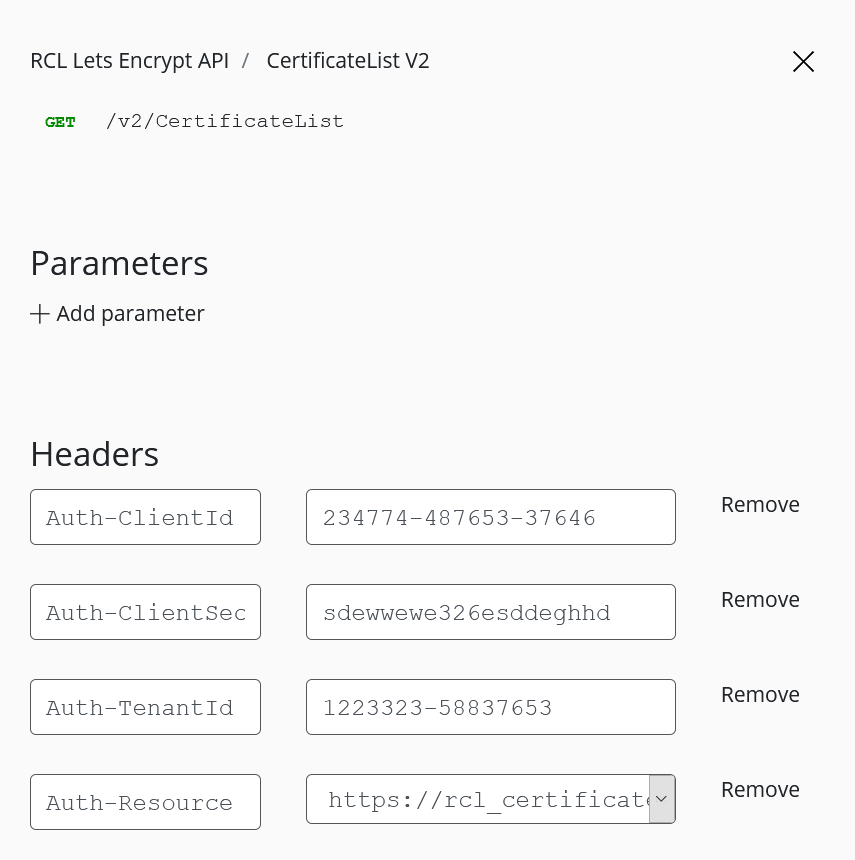

# Authorization: Obtaining an Access Token

The **RCL API** uses the [OAuth 2.0 Client Credentials Grant](https://oauth.net/2/grant-types/client-credentials/#:~:text=The%20Client%20Credentials%20grant%20type,to%20access%20a%20user's%20resources.) flow to get an access token to make API requests.

To obtain the token, the following steps must be followed by a user:

- Register an AAD Application
- Set Access Control for the AAD application to access resources in their Azure subscription
- Register the AAD Application's Client Id in the **RCL Portal**
- Make a POST request to the AAD Application-specific token endpoint to obtain the token

## Registering an AAD Application

To register an AAD application, please follow the instruction in this link :

- [Registering an AAD Application](../authorization/aad-application)

## Get the AAD Credentials

To obtain the following credentials from the AAD application:

- Client Id
- Client Secret
- Tenant Id

follow the instructions in this link :

- [Get the AAD Application Credentials](../authorization/aad-application#get-the-aad-application-credentials)

## Set Access Control for the AAD application

A user must set access control for the AAD application to access resources in their Azure subscription. Please refer to the following link :

- [Setting Access Control for the AAD Application](../authorization/access-control-app)

## Add the Client Id in the RCL Portal

A user must add the Client Id in the **RCL Portal** in order to associate the AAD application with the user's RCL subscription.

- Open the **RCL Portal**

- In the 'Subscription' section, click on 'API Client', then click the 'Register a Client Id' button


- Add the **Client Id** for the AAD application. (To obtain the Client Id from the AAD application, please refer to : [Get the AAD Application Credentials](../authorization/aad-application#get-the-aad-application-credentials)


- Click the 'Submit' button 
 
## Request an Access Token

 To request an access token, use an HTTP POST to the Application-specific Azure AD token endpoint.

 ```
 https://login.microsoftonline.com/<tenantId>/oauth2/token
 ```

 Replace the `tenantId` place holder with the **Tenant Id** credential for the user's AAD Application.

 Include the following parameters in the **body** of the POST request in the [Form-UrlEncoded](https://developer.mozilla.org/en-US/docs/Web/HTTP/Methods/POST) format :

- grant_type : should be ``client_credentials``
- client_id : the Client Id of the AAD application
- client_secret : the Client Secret of the AAD application
- resource : the Azure Resource Manager resource, should be ``https://management.core.windows.net``   

 ### Example

 ```
POST /contoso.com/oauth2/token HTTP/1.1
Host: login.microsoftonline.com
Content-Type: application/x-www-form-urlencoded

grant_type=client_credentials&client_id=625bc9f6-3bf6-4b6d-94ba-e97cf07a22de&client_secret=qkDwDJlDfig2IpeuUZYKH1Wb8q1V0ju6sILxQQqhJ+s=&resource=https%3A%2F%2Fmanagement.core.windows.net
 ```

## Service Response

A success response contains a JSON OAuth 2.0 response with the following parameters:

| Parameter | Description |
| --- | --- |
| access_token |The requested access token. |
| token_type |Indicates the token type value. |
| expires_in |How long the access token is valid (in seconds). |
| expires_on |The time when the access token expires. The date is represented as the number of seconds from 1970-01-01T0:0:0Z UTC until the expiration time. This value is used to determine the lifetime of cached tokens. |
| not_before |The time from which the access token becomes usable. The date is represented as the number of seconds from 1970-01-01T0:0:0Z UTC until time of validity for the token.|
| resource |The App ID URI of the receiving web service. The RCL resource. |


### Example of response

The following example shows a success response to a request for an access token.

```
{
"access_token":"eyJ0eXAiO ... 0X2tnSQLEANnSPHY0gKcgw",
"token_type":"Bearer",
"expires_in":"3599",
"expires_on":"1388452167",
"resource":"https://management.core.windows.net"
}
```

## Use the Access Token to Make a Request

Use the acquired access token to make authenticated requests to the RCL APIs by setting the token in the Authorization header as a **Bearer** token.

### Example

```
GET /api/v2/CertificateList HTTP/1.1
Host: letsencryptapi.azure-api.net
Authorization: Bearer eyJ0eXAiO ... 0X2tnSQLEANnSPHY0gKcgw
```

## Access Token in the Developer's Portal

 The [RCL API Developer's Portal](https://letsencryptapi.developer.azure-api.net/) is used to explore and test the APIs.  You can get an Access Token in the portal by adding the AAD Credentials in the Header Section of the 'Try API' page.



## Related Articles

- [Introduction to RCL API](./introduction)
- [GET Certificate](./get-certificate)
- [GET CertificateList](./get-certificate-list)
- [POST CertificateRenewal](./post-certificate-renewal)
- [POST Certificate](./post-certificate-renewal)
- [Recommendations for Automation System Design](./automation-system)
