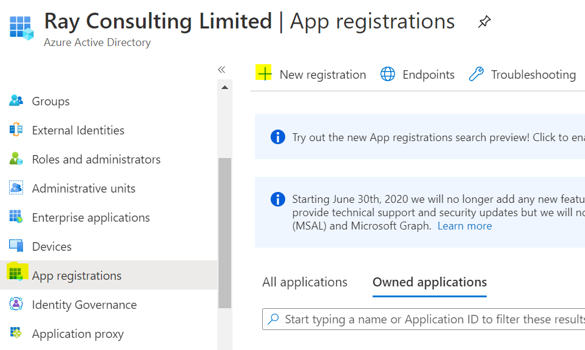
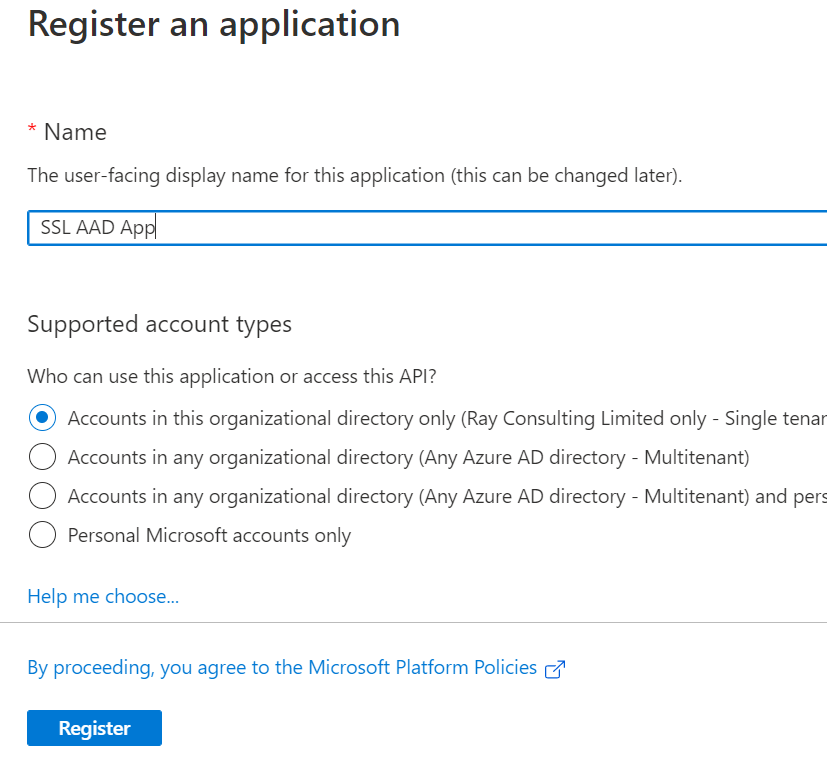
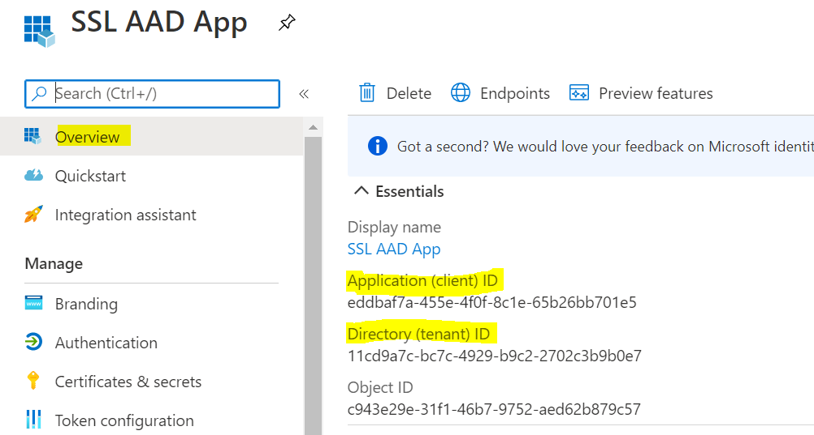
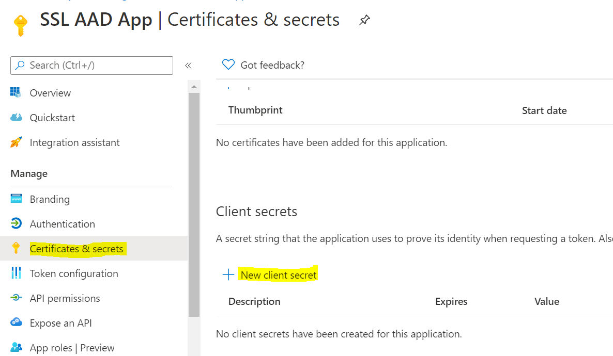
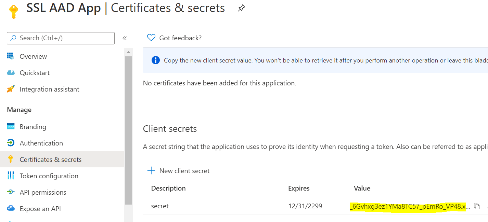

---
title: AAD Application
description: Learn how to create an Azure Active Directory Application for use in RCL applications
parent: Authorization
nav_order: 4
---

## Register an AAD Application
**V6.0.10**

**Authorization** is required for the following operations :

- to make authorized requests to the RCL Public API
- to use the [RCL AutoRenew](../autorenew/autorenew) Function app
- to access Azure App Services , Key Vault and DNS Zone

 This authorization will be granted through an **AAD Application**.

- In your **Azure Active Directory (AAD)** tenant, add a new 'App registration'

- Add a name for the  new App registration. The app should access accounts in the user's organizational directory only (Single tenant)

- Click the 'Register' button 

## Get the AAD Application Credentials

- In the Active Directory, open the application that was registered

- Copy the **Application (client) ID** [Auth:client_id] and **Directory (tenant) ID** [Auth:tenantId] for configuration purposes

- In the 'Certificates & secrets', create a new client secret. You must remember to change the client secret when it expires. It is recommended that you use the maximum expiry period for the secret.

- Copy the Client Secret **Value** for configuration purposes [Auth:client_secret] 

## Next Step

- [Set Access Control for the AAD application](./access-control-app)

## Related Articles

- [AutoRenew Function](../autorenew/autorenew.md)