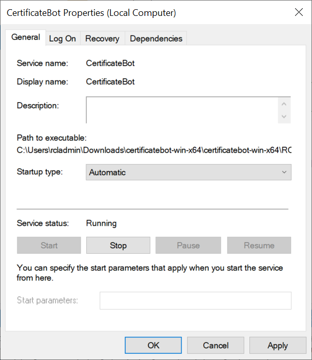

# RCL CertificateBot for IIS
**V6.0.10**

RCL CertificateBot runs as a **Windows Service** in a Windows Server. The Windows Service will run every seven (7) days to automatically renew and save SSL/TLS certificates from a user's subscription in the **RCL Portal** to a Windows hosting machine.

Certificates will be automatically saved to the ``Local Machine`` certificate store in the  ``Trusted People`` folder. Certificates will also be automatically bound to the **IIS Web Server** on the hosting machine.

## Automatically Renew SSL/TLS Certificates

You can use RCL CertificateBot to automatically renew SSL/TLS certificates created in the **RCL Portal** using the the following creation options :

- Azure DNS (including SAN) - **Recommended**

**'Stand Alone' certificates are not supported by RCL CertificateBot.**

# Install RCL CertificateBot for IIS
## Download the Files

- The Windows Service files (``certificatebot-iis-win-xx``) are available in the [GitHub Project](https://github.com/rcl-ssl/RCL.CertificateBot) page in the [Releases](https://github.com/rcl-ssl/RCL.CertificateBot/releases/tag/V6.0.10) section:

- Download the zip file with bitness :

  - [win-x86](https://github.com/rcl-ssl/RCL.CertificateBot/releases/download/V6.0.10/certificatebot-iis-win-x86.zip)
  - [win-x64](https://github.com/rcl-ssl/RCL.CertificateBot/releases/download/V6.0.10/certificatebot-iis-win-x64.zip) 
  - [win-arm](https://github.com/rcl-ssl/RCL.CertificateBot/releases/download/V6.0.10/certificatebot-iis-win-arm.zip)
  
  to match your Windows server bitness

- Extract the zip file to a folder on your server after it is downloaded

## Configure the Service

### Register an AAD Application

An Azure Active Directory (AAD) application must be registered to obtain permission to access a user's Azure resources (**DNS Zone**). 

Please refer to the following link to register an AAD application:

- [Registering an AAD Application](../authorization/aad-application)

### Set Access Control for the AAD Application

Access control must be set for the AAD application to access resources (**DNS Zone**) in a user's Azure subscription. Please refer to the following link to set access control :

- [Setting Access Control for the AAD Application](../authorization/access-control-app)

### Get the AAD Application Credentials 

To obtain the following credentials from the AAD application:

- ClientId
- ClientSecret
- TenantId

follow the instructions in this link :

- [Get the AAD Application Credentials](../authorization/aad-application#get-the-aad-application-credentials)

### Get the SubscriptionId

Get the **Subscription Id** in the RCL Portal.


- Scroll down and copy the 'Subscription Id' 


### Register the AAD Application's ``Client Id`` in the RCL Portal

The AAD Application must be associated with a user's RCL subscription. This is achieved by registering the AAD Application's ``Client Id`` in the **RCL Portal**.

To add the AAD Application's ``Client Id`` to the portal, please follow the instructions in this link :

- [Add the Client Id in the RCL Portal](../api/authorization#add-the-client-id-in-the-rcl-lets-encrypt-portal)

### Add the Configuration variables

- In the folder containing the files for the Windows Service that you extracted, find and open the **appsettings.json** file

- Add the credentials for the AAD Application and SubscriptionId in the **RCLSDK** section :
  - ClientId
  - ClientSecret
  - TenantId
  - SubscriptionId

- In the **CertificateBot** section, set a folder path to save the SSL/TLS certificates. Recommended path : C:/ssl

  - saveCertificatePath

- Create the folder in the server and ensure it has read/write permissions so that the certificates can be saved to it. 

- Configure the site bindings for each website that you want to bind a SSL/TLS certificate. You can have a single or multiple bindings.

- Example of multiple bindings :

```
"IISBindings": [
  {
    "ip": "*",
    "port": "443",
    "siteName": "Home",
    "host": "shopneur.com",
    "certificateName": "shopeneur.com,*.shopeneur.com"
  },
  {
    "ip": "*",
    "port": "443",
    "siteName": "Home",
    "host": "www.shopneur.com",
    "certificateName": "shopeneur.com,*.shopeneur.com"
  }
]
```

- siteName - this the the site name of the IIS website
- ip - this is the IP address of the IIS website (you can use any (``*``))
- port - the is the port number of the IIS website (you can use ``443``)
- host - the the host name assigned to the IIS website
- certificateName - this is the name of the certificate in the RCL Portal to be installed in the IIS website


## Example of a configured **appsettings.json** file

```
{
  "Logging": {
    "LogLevel": {
      "Default": "Information",
      "Microsoft": "Warning",
      "Microsoft.Hosting.Lifetime": "Information"
    },
    "EventLog": {
      "LogLevel": {
        "Default": "Information",
        "Microsoft.Hosting.Lifetime": "Information"
      }
    }
  },
  "RCLSDK": {
    "ApiBaseUrl": "https://rclapi.azure-api.net/public",
    "SourceApplication": "RCL CertificateBot IIS",
    "ClientId": "35ca82aa-9ff3-5a67-bb7f-c3c71027eecf",
    "ClientSecret": "hdytev539dgw~_8-g4lNI84V01.yIDUMHh",
    "TenantId": "22cd4a8c-bc2c-3618-b1c3-4610c1b9b3e8",
    "SubscriptionId": "879"
  },
  "CertificateBot": {
    "IncludeCertificates":[],
    "SaveCertificatePath": "C:/ssl",
    "IISBindings": [
      {
        "ip": "*",
        "port": "443",
        "siteName": "Home",
        "host": "shopneur.com",
        "certificateName": "shopeneur.com,*.shopeneur.com"
      },
      {
        "ip": "*",
        "port": "443",
        "siteName": "Home",
        "host": "www.shopneur.com",
        "certificateName": "shopeneur.com,*.shopeneur.com"
      }
    ]
  }
}
```
- Save the **appsettings.json** file when you are done.

# Create the Windows Service

- Open a **Command Prompt** in the Windows server as an **Administrator**

- Run the command to install the Windows Service. Replace the < file-path > placeholder with the actual path where your windows service files were downloaded and extracted

```
sc.exe create CertificateBot binpath= <file-path>\RCL.CertificateBot.IIS.exe
```

- After the service in installed, open **Services** in the Windows, look for the ``CertificateBot`` service and **Start** the service


- You can set the **Properties** of the service to start automatically when the server starts



# View the Event Logs

- Open **Event Viewer**, under 'Windows Logs > Application', look for the 'RCL.CertificateBot.IIS' events


- Ensure that there are no error events for the service. If there are error events, the service is misconfigured and will not function

- Each time a certificate is downloaded and saved in the server or a certificate is scheduled for renewal, a log will be written

# Fixing Errors

If you encounter error events for the service in the Event Viewer, please stop the service and delete it completely. 

Ensure the ``appsettings`` configuration is correct for the AAD Application and the certificate save path settings point to a folder that exists. Then, re-install and restart the service.

# Deleting the Windows Service

If you need to remove the Windows Service for any reason, run the command to delete the service

```
sc.exe delete CertificateBot  
```