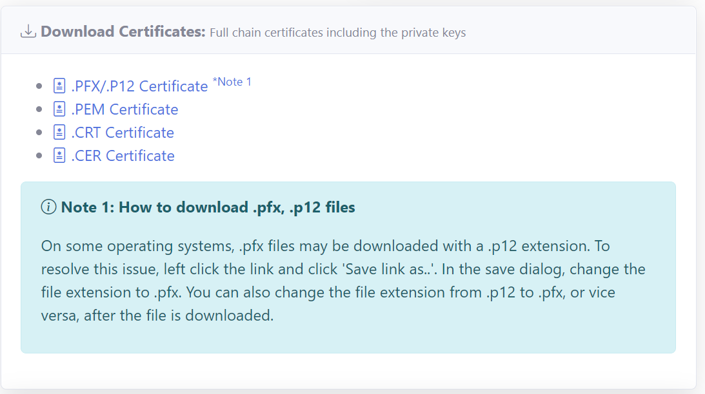

# Installing TLS/SSL Certificates in Apache Tomcat
**V6.0.10**

This article assumes that you have experience with Apache Tomcat in Linux or Windows.

You can use a .PFX (PKCS12) file to install a TLS/SSL certificate in Apache Tomcat.

You can download your TLS/SSL certificate in .PFX format :

- **manually** : from the **RCL Portal** on the **Certificate Details** page



- **automatically** : using the [RCL CertificateBot](../certbot/certbot). The CertificateBot will also automatically renew certificates. The certificate files will be saved on the hosting machine at the path you specified in the ``appsettings.json`` configuration file.

Tomcat can use a PFX (PKCS12) file just fine, there is no need to convert to JKS.

1. Open : ```/YOUR-PATH-TO-TOMCAT/conf/server.xml``` in XML or text editor.

2. Find the following lines for port 443 (or 8443) similar to the ones below. (If you do not find the lines, jump to point 4 and add whole tag in server.xml and change keystoreFile and keystorePassword)

```
<!--
<Connector 
 port="8443"
 protocol="org.apache.coyote.http11.Http11NioProtocol"
 maxThreads="150" 
 SSLEnabled="true">
 <SSLHostConfig>
    <Certificate certificateKeystoreFile="conf/localhost-rsa.jks"
    type="RSA" />
 </SSLHostConfig>
</Connector>
    -->
```

3. Delete the comment markers at the beginning of the code (<!–) and at the end of the code (–>)

4. Add the following attributes, change the keystoreFile and keystorePassword. The keystoreFile, is the path to where your PFX certificate is stored on the hosting machine. The keystorePassword can be found in the **Certificate Details** page (```Certificate Password```) in the **RCL Portal**.

```
<Connector
    protocol="org.apache.coyote.http11.Http11NioProtocol"
    port="443"
    maxThreads="150"
    SSLEnabled="true">
  <SSLHostConfig>
    <Certificate
      certificateKeystoreFile="/path/to/certificate.pfx"
      certificateKeystorePassword="pwd1234"
      type="RSA"
      />
    </SSLHostConfig>
</Connector>
```

5. Save server.xml file.

6. Restart the Tomcat server.

Now you can confirm your domain SSL certificate using any of the SSL checker tools available. Or you can just browse the URL.