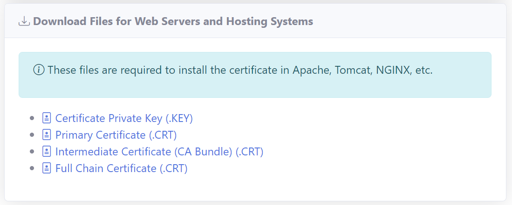

# Installing TLS/SSL Certificates in Apache Server
**V6.0.10**

This article assumes that you have experience with Apache 2 and configuring Virtual Hosts in Linux or Windows.

## Get the Certificate Files Manually

You can download the files required to install the TLS/SSL certificate in the Apache web server from the **RCL Portal** on the **Certificate Details** page.



## Get the Certificate Files Automatically

You can also use the [RCL CertificateBot](../certbot/certbot) to automatically renew and download the files required to install the TLS/SSL certificate in the Apache web server.

## Files Required

The files required are :

- Certificate Private Key (.key)
- Primary Certificate (.crt)
- Intermediate Certificates (CA Bundle) (.crt)

## Assigning the TLS/SSL certificate to Apache

After you have downloaded the certificate files, the next step is to edit your Apache configuration file to use them.

It is assumed that you have Apache 2 already installed and hosting your website on your server. In addition, you have established your own custom domain name that points to your website.

## Ensure the SSL module is enabled in apache.

### Linux Command 
```
sudo a2enmod ssl
```

### Windows :

In the ```httpd.conf``` file, change the following lines by removing the leading # sign in order to uncomment the lines:

```#Loadmodule ssl_module modules/mod_ssl.so```

```#LoadModule socache_shmcb_module modules/mod_socache_shmcb.so```

```#Include conf/extra/httpd-default.conf```


## Create a Virtual Host

In your server, create a **Virtual Host** entry or file for your domain under the recommended folder. Use it to enable SSL and include the certificate files as required. (If there is a SSL default template available in your apache server, then use the template to create the Virtual Host). In Windows, edit the ```httpd-ssl.conf``` file.

Please see the Virtual host example below:

```
<VirtualHost *:443>

   ServerAdmin admin@mail.com
   DocumentRoot /path/to/mysite
   ServerName mydomain.com
   ServerAlias www.mydomain.com

# This is the important section   

   SSLEngine on
   SSLCertificateFile	/path/to/primaryCertificate.crt
   SSLCertificateKeyFile /path/to/privateKey.key
   SSLCertificateChainFile /path/to/caBundle.crt
  
</VirtualHost>
```

You can modify the names of the files and paths to match the location and filename that you used to save your certificate files:

- **SSLCertificateFile** - should be your **Primary Certificate** file (.crt)
- **SSLCertificateKeyFile** - should be the **Certificate Private Key** file (.key)
- **SSLCertificateChainFile** - should be the **CA Bundle** (Intermediate Certificates) file (.crt)

Ensure the Virtual host is enabled in apache. 

Linux example command for 'mysite.conf' :

```
sudo a2ensite mysite.conf
```

Reload the Apache service once you're done.

Linux command:

```
sudo systemctl reload apache2
```

Now you can confirm your domain SSL certificate using any of the SSL checker tools available. Or you can just browse the URL.