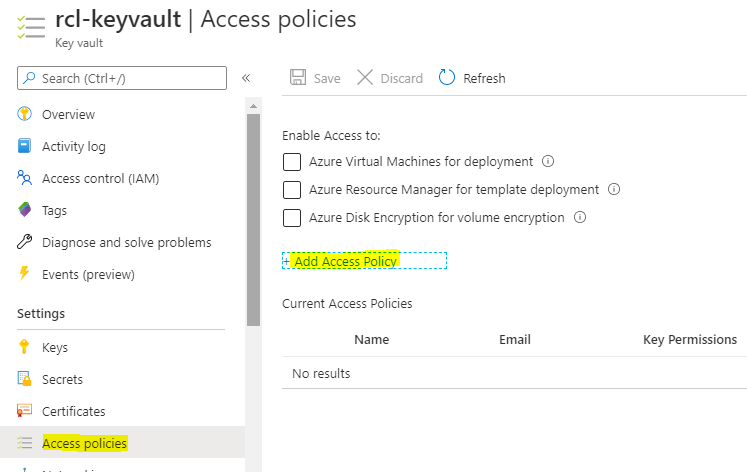
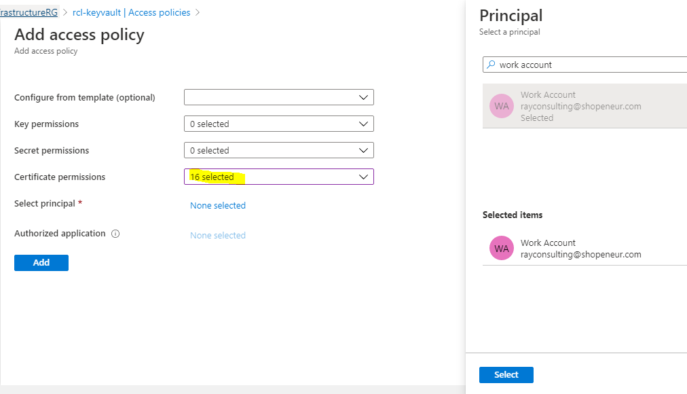
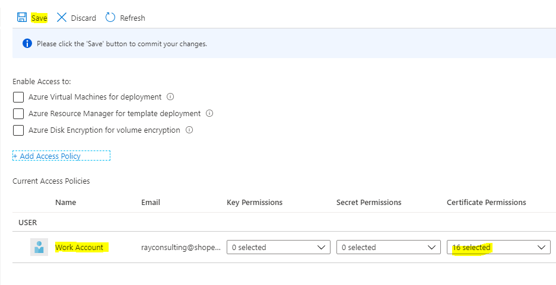
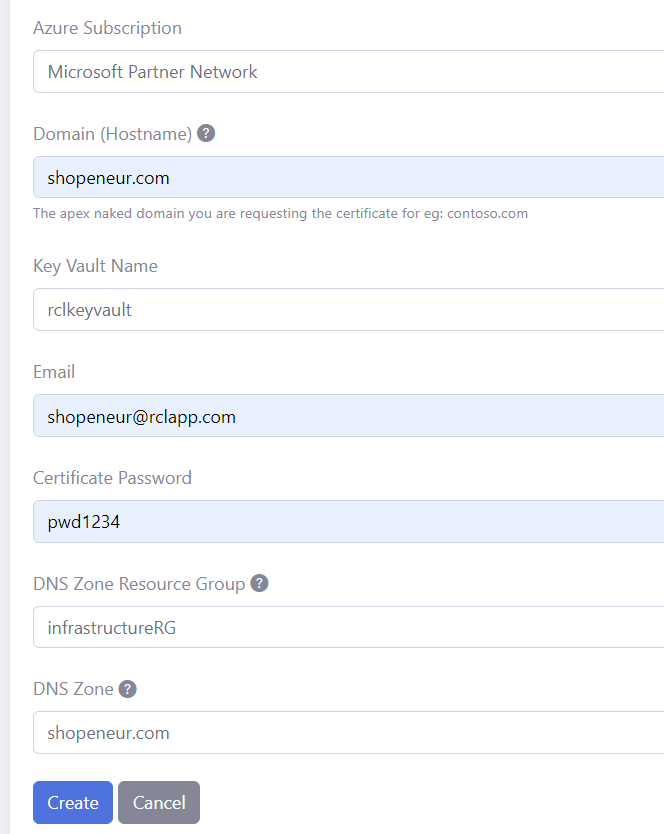
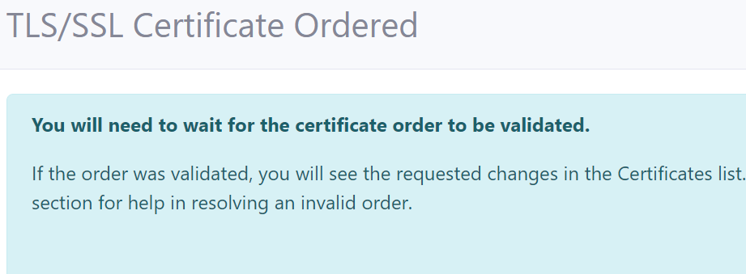
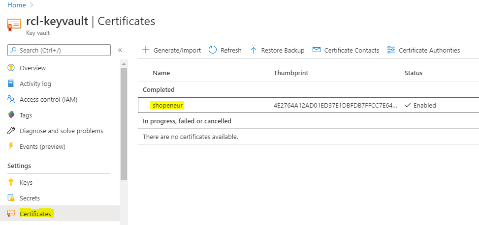

# SAN Certificate - Azure Key Vault
**V6.0.10**

RCL creates TLS/SSL certificates using an [Azure DNS Zone](https://docs.microsoft.com/en-us/azure/dns/dns-zones-records) and automatically saves them to [Azure Key Vault](https://docs.microsoft.com/en-us/azure/key-vault/general/basic-concepts).

A Subject Alternative Name (SAN) TLS/SSL certificate will contain multiple domains in a single certificate. SAN certificates created with an **Azure DNS Zone** will contain the naked apex domain (e.g. contoso.com) and the wild card domain (e.g. *.contoso.com) in a single TLS/SSL certificate.

# Single Apex Domains

SAN certificates only allow a single apex domain. For instance, the two domains 'fabricam.com' and 'contoso.com' are not allowed in a SAN multi-domain certificate.

# Access Control

## AAD Accounts

**Personal and Microsoft Accounts are not supported for Azure DNS. Only Azure Active Directory (AAD) organizational accounts (also known as ‘Work or School Accounts’) are supported.**

If you try to manage Azure DNS / Key Vault with a MSA account you will get the following error.

If you signed up for the RCL Portal with a personal Microsoft account (MSA), please follow the instructions in the following link to associate an AAD account to your subscription:

- [Sign-In Accounts for RCL](../authorization/sign-in-accounts)

## Set Access Control

To create certificates for Azure DNS / Key Vault, the Azure AAD organizational account that you use to login to the RCL Portal must either be :

- An administrator to the subscription containing the Azure DNS Zone(s) / Key Vault(s)

- Have a role of ‘Owner’ or ‘Contributor’ to the subscription containing the Azure DNS Zone(s) / Key Vault(s)

If either of these requirements are not met, the ‘subscriptions’, 'Key Vault' and ‘DNS Zone’ lists will be empty when you try to create a certificate.

You may also experience an error message.

To set up access control for your AAD account, follow the instructions in the link below :

- [Set Access Control for the AAD user](../authorization/access-control-user)

# Create a SSL/TLS Certificate using DNS-01

RCL uses the DNS-01 challenge type to issue certificates for :

- primary domains (e.g. contoso.net)
- subdomains (e.g. store.contoso.net)
- wild card subdomains (e.g. *.contoso.net)

**The DNS challenge type ONLY works with an Azure DNS Zone.**

# Create a DNS Zone and Configure Name Server

If you bought your domain with a domain registrar, you must set up your Azure DNS Zone to manage the records for your domain.

Follow the instructions in the link below to set up your DNS Zone and delegate the name server (NS) records for your domain :

- [Delegate DNS Zone](https://docs.microsoft.com/bs-latn-ba/azure/dns/dns-delegate-domain-azure-dns)

# Azure Key Vault

If you do not have an Azure Key Vault, follow the steps in this link to create one :

- [Create an Azure Key Vault](https://docs.microsoft.com/en-us/azure/key-vault/general/quick-create-portal)

# Set Access Policy for Key Vault

You must have security access to the Azure Key Vault certificate operations.

**If you do not set the access policy for Key Vault, you will experience 'Access Denied' or 'Forbidden' errors when you try to create a certificate.**

This is required to import the SSL/TLS certificate in a Key Vault in your Azure account. If you have not yet created an access policy for your certificates, then follow these steps.

- In your Azure Key Vault, click on the ‘Access policies’ link. Then click on ‘Add Access Policy’.

- Select all the permissions for the ‘Certificate permissions’ (all 16 permissions). Ensure you include the **purge** permission.

- Select a service principal : search for the Azure Active Directory organizational account that you use to login to the RCL Portal

- Click the ‘Select’ button

- Click the ‘Add’ button when you are done

- The new access policy will be added

- Click the ‘Save’ icon at the top to save the access policy

- In the ‘Certificates’ module of the portal, click on the **Create New SSL/TLS Certificate** link

- Select the ‘Azure Key Vault SAN’ option.

- Add the data to create the certificate. The image below illustrates sample data.

- The Hostname is the single Apex Domain (eg: 'contoso.com') you are requesting the certificate for. Only a single domain is allowed. The additional wildcard domain (eg: *.contoso.com) will be automatically added to the certificate.

- In the case above, we are requesting a SAN SSL/TLS certificate for the naked apex domain, ‘shopeneur.com’. The wild card domain '*.shopeneur.com' will be automatically included in the certificate.

- Select the Key Vault name.

- The Host Name must be valid for the DNS Zone. For instance, the naked apex domain ‘shopeneur.com’ is valid for the DNS Zone ‘shopeneur.com’

- Click the **Create Button** when you are done

- You will need to wait up to 10 mins to validate the site and install the certificate. When this is done, the SSL/TLS certificate will be displayed in the certificates list.

- When this is done, the SSL/TLS certificate will be displayed in the certificates list.

- You can now access your certificate in your Azure Key Vault in the Azure portal.

# Manually Renewing SSL/TLS Certificates

SSL/TLS certificates will expire in 90 days. You can manually renew a certificate at any point before the expiry date. Click on the 'Update' link in the 'Manage' menu in the certificates list to update a certificate.

# Automatic Certificate Renewal and Installation

You can use the [RCL AutoRenew Function](../autorenew/autorenew) to automatically renew certificates in Azure Key Vault.

Follow the instructions in the link to use the AutoRenew function :

- [RCL AutoRenew Function](../autorenew/autorenew)

# Rate Limits

**There is a rate limit of 50 SSL/TLS certificates per subscription.**

In addition, Let's Encrypt has instituted rate limits to ensure fair usage by as many people as possible. To find out more about these rate limits please refer to the following link :

- [Let's Encrypt Rate Limits](https://letsencrypt.org/docs/rate-limits/)
