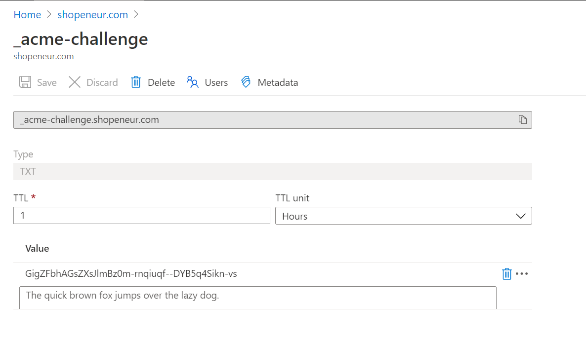

# Create a Free TLS/SSL Certificate

You can create a free TLS/SSL certificate in the [RCL Website's](https://rclapp.com) home page.

- Add the hostname. **The hostname must be a primary apex domain (eg. contoso.com)**. Sub-domains (eg. www.contoso.com, shop.contoso.com, etc) , wild card domains (eg. *.contoso.com) and mult-domain SAN are not supported in free certificates. Do not include 'http' or 'https' in your hostname. Click the 'Create Now' button when you are done

- Add a Microsoft Email for the SSL/TLS certificate. **If you do do not have a Microsoft Email, you can create one in the Sign-In page**

- Add a password for the certificate

# Completing the DNS Challenge
In your management portal from your domain registrar, add a DNS TXT record (name/host) as defined in the ‘DNS Validation’ page (note the underscore '_' at the start) with the value as defined on the page

- This is an example of a DNS TXT record in the 'Azure DNS Zone' domain management portal

- This is another example of a DNS TXT record in the 'GoDaddy' domain management portal  

- Your domain registrar will have a similar portal to add your DNS TXT record

- You can test the DNS record in the [Dig site](https://toolbox.googleapps.com/apps/dig/). In the site add the name identified in the DNS Validation page; and select the **TXT** record. The value for the record will be shown in the **TXT** section

- If you see the correct DNS TXT record and value as specified in the validation page, the test is successful

- If the test is successful, click the Validate button. 

- You will need to wait up to 10 mins to validate the DNS record and create the certificate. When this is done, the SSL/TLS certificate will be displayed in the Certificates Details page.

# Accessing the TLS/SSL Certificate

- To access the certificate, click the **Go to Certificate Details** button 

- You can download the certificate in .PFX, .CER, .CRT or .PEM formats.

- You can also download the Certificate files required for installation in specific web servers (Apache, Apache Tomcat, NGINX, etc). The files include :

- Certificate Private Key (.key)
- Primary Certificate (.crt)
- Intermediate Certificate (CA Bundle) (.crt)
- Full Chain Certificate (.crt)

# Certificate Installation

You will need to manually download and install your certificate in your web server. The following links provides instructions on how to install the certificate in a web server

- [Installing SSL/TLS Certificates in Web Servers and Hosting Services](../installations/web-servers)
- [Installing SSL/TLS Certificates in Apache Server](../installations/apache)
- [Installing SSL/TLS Certificates in Apache Tomcat](../installations/apache-tomcat)
- [Installing SSL/TLS Certificates in NGINX](../installations/nginx)
- [Installing SSL/TLS Certificates in IIS](../installations/iis)

# Rate Limits

**There is a rate limit of 1 SSL/TLS certificate per email per week.**

