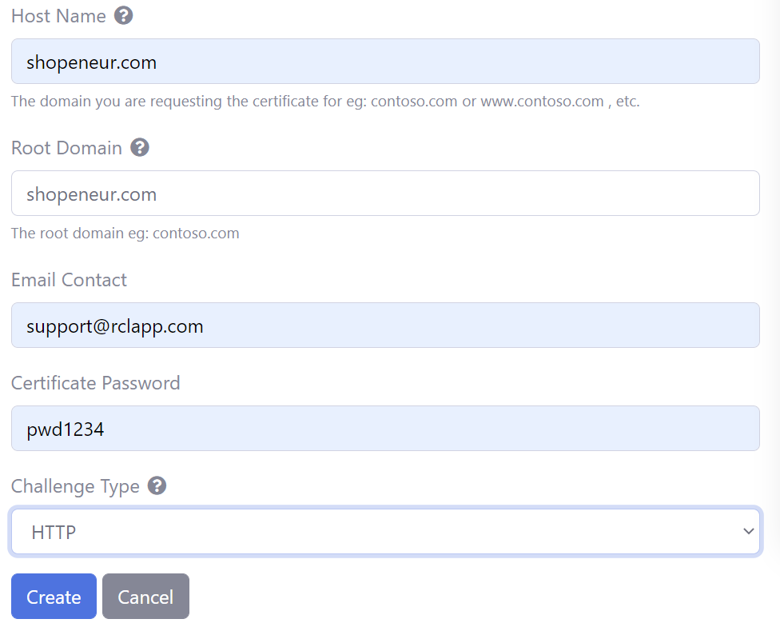
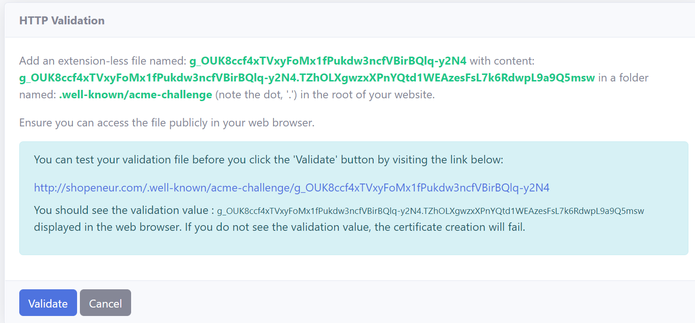
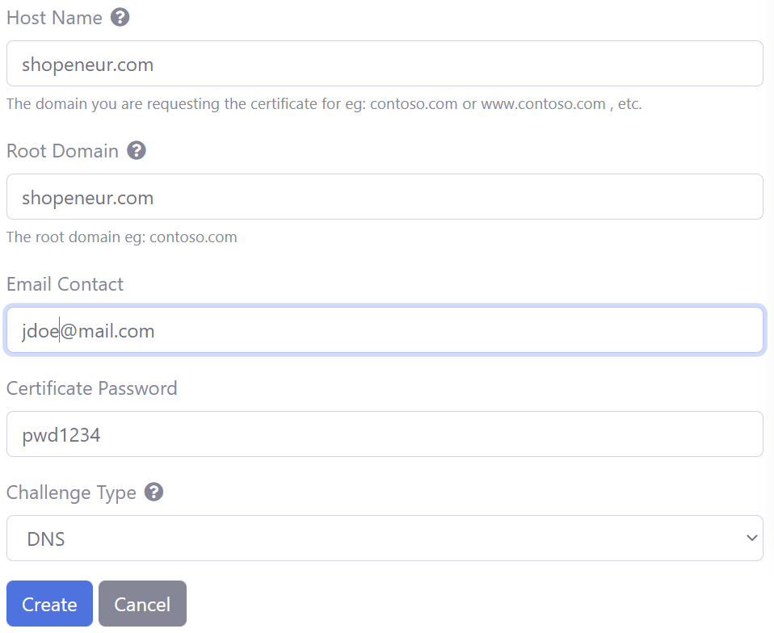
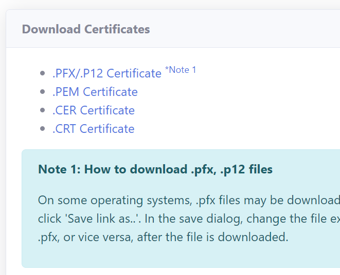

# Creating Stand Alone SSL/TLS Certificates
**V6.0.10**

In the RCL Portal, you can create Stand Alone single-domain SSL/TLS certificates using HTTP and DNS challenges. Your domain can be hosted with any domain registrar.

You will need to manually download and install the certificate in your web server.


**When a certificate is close to expiration, you should delete the certificate and create a new one. Then, install the renewed certificate in your web server.**

You can create a SSL/TLS certificate by using either the :

- HTTP-01 Challenge or
- DNS-01 Challenge

# Create a SSL/TLS Certificate using HTTP-01

The RCL Portal uses the HTTP-01 challenge type to issue certificates for : 

- primary domains (e.g. contoso.net)
- subdomains (e.g. store.contoso.net, www.contoso.net, etc.)

To validate your domain with the HTTP challenge, you will be required to place a file in the root of your website and ensure that this file can be accessed publicly on the web.

**Wildcard subdomains (e.g. \*.contoso.net) are NOT supported with the HTTP-01 challenge type. Use the DNS-01 challenge type for wildcard certificates instead.**

## Create a SSL/TLS Certificate

- In the ‘Certificates’ module of the portal, click on the **Create New SSL/TLS Certificate** link


- Select the **Stand Alone Certificate** option


- Add the data to create the certificate. The image below illustrates data for a sample site.

    - The **Host Name** is the primary domain (eg: contoso.com) or subdomain (eg: store.contoso.com) that your are requesting the SSL/TLS certificate for.

    - In this case, we are requesting a SSL/TLS certificate for the primary domain, ‘shopeneur.com’

    - The root domain is the ‘apex’ domain. For instance, the root domain for the hostname: ‘shop.contoso.com’ is ‘contoso.com’. Similarly, the root domain for the hostname : ‘contoso.com’ is ‘contoso.com’ and '*.contoso.com' is 'contoso/com'.



- **The website must exist at the domain you entered, eg. in our example, the website can be accessed at 'http://shopeneur.com' in a web browser**

- Click the **Create** button when you are done

### Completing the HTTP Challenge

- In your hosted website, you will need to create a folder named: **.well-known/acme-challenge** (note the dot at the start) in the root of your website.

- Add a extension-less file with the file name identified in the HTTP Validation page. To this file, add the file content identified in the **HTTP Validation Page**.



- The following example image illustrates the file in the web root directory


**Note:** - for sites hosted in a Windows Server in IIS, extension-less files are not served by default. To solve this, add the following ``web.config`` file to the ``acme-challenge`` folder.

```
<configuration>
    <system.webServer>
        <staticContent>
            <mimeMap fileExtension="." mimeType="text/plain"/>
        </staticContent>
    </system.webServer>
</configuration>
```

- Ensure the website and ‘well known’ file can be accessed publicly on the web. On the **HTTP Validation Page**, click on the link to test your validation file 

- For a successful test, you should see the validation value in the web browser.


- If the test is successful, click the 'Validate' button. If the test is not successful the certificate creation will fail.

### Certificate Creation

- You will need to wait up to 10 mins to validate the site and create the certificate. When this is done, the SSL/TLS certificate will be displayed in the certificates list.


- When this is done, the SSL/TLS certificate will be displayed in the certificates list.


- You can download the SSL/TLS certificate or the relevant certificates files for installation in your webserver is the **Certificate Details** page.

# Create a SSL/TLS Certificate using DNS-01

RCL uses the DNS-01 challenge type to issue certificates for :

- primary domains (e.g. contoso.net)
- subdomains (e.g. store.contoso.net, www.contoso.net, etc.)
- wild card subdomains (e.g. *.contoso.net)

## Add a SSL/TLS Certificate

- In the ‘Certificates’ module of the RCL Portal , click on the 'Create New SSL/TLS Certificate' link.


- Select the **Stand Alone Certificate** option


- Add the data to create the certificate. The image below illustrates sample data.

- The ‘Host Name’ is the primary domain (eg. contoso.com), subdomain (eg. shop.contoso.com) or wildcard subdomain (eg. *.contoso.com) that your are requesting the SSL/TLS certificate for.

- In this case, we are requesting a SSL/TLS certificate for the custom primary domain, ‘shopeneur.com’.

- The root domain is the ‘apex’ domain. For instance, the root domain for the hostname: ‘shop.contoso.com’ is ‘contoso.com’. Similarly, the root domain for the hostname : ‘contoso.com’ is ‘contoso.com’.



- Click the 'Create' button when you are done

### Completing the DNS Challenge

- In your management portal from your domain registrar, add a DNS TXT record (name/host) as defined in the ‘DNS Validation’ page (note the underscore '_' at the start) with the value as defined on the page


- This is an example of a DNS record


### Verifying the DNS TXT Record with Dig

- You can test the DNS record in the [Dig site](https://toolbox.googleapps.com/apps/dig/). In the site, add the name identified in the DNS Validation page; and select the **TXT** record. The value for the record will be shown in the **TXT** section


- If you see the correct DNS TXT record and value, the test is successful

- If the test is successful, click the 'Validate' button. 

### Certificate Creation

- You will need to wait up to 10 mins to validate the site and create the certificate. When this is done, the SSL/TLS certificate will be displayed in the certificates list.


- When this is done, the SSL/TLS certificate will be displayed in the certificates list.


- You can download the SSL/TLS certificate or the relevant certificates files for installation in your webserver is the **Certificate Details** page.

# Accessing the TLS/SSL Certificate

- To access the certificate, click the **Details** button in the **Manage** menu in the certificates list page.

- You can download the certificate in .PFX, .CER, .CRT or .PEM formats.



- You can also download the Certificate files required for installation in specific web servers (Apache, Apache Tomcat, NGINX, etc). The files include :

- Certificate Private Key (.key)
- Primary Certificate (.crt)
- Intermediate Certificate (CA Bundle) (.crt)
- Full Chain Certificate (.crt)


# Certificate Installation

You will need to manually download and install your certificate in your web server. The following links provides instructions on how to install the certificate in a web server

- [Installing SSL/TLS Certificates in Web Servers and Hosting Services](../installations/web-servers)
- [Installing SSL/TLS Certificates in Apache Server](../installations/apache)
- [Installing SSL/TLS Certificates in Apache Tomcat](../installations/apache-tomcat)
- [Installing SSL/TLS Certificates in NGINX](../installations/nginx)
- [Installing SSL/TLS Certificates in IIS](../installations/iis)

# Certificate Renewal

When a certificate is close to expiration, you should delete the certificate and create a new one. Then, install the new certificate in the web server.

# Rate Limits

**There is a rate limit of 50 SSL/TLS certificates per subscription.**

In addition, Let's Encrypt has instituted rate limits to ensure fair usage by as many people as possible. To find out more about these rate limits please refer to the following link :

- [Let's Encrypt Rate Limits](https://letsencrypt.org/docs/rate-limits/)
